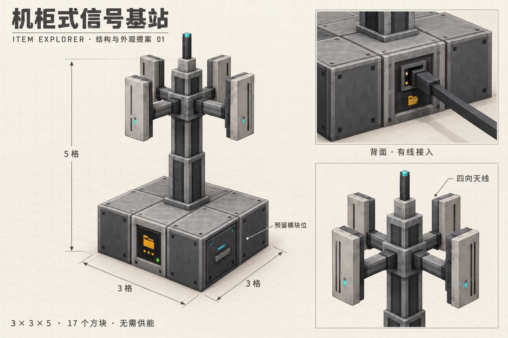
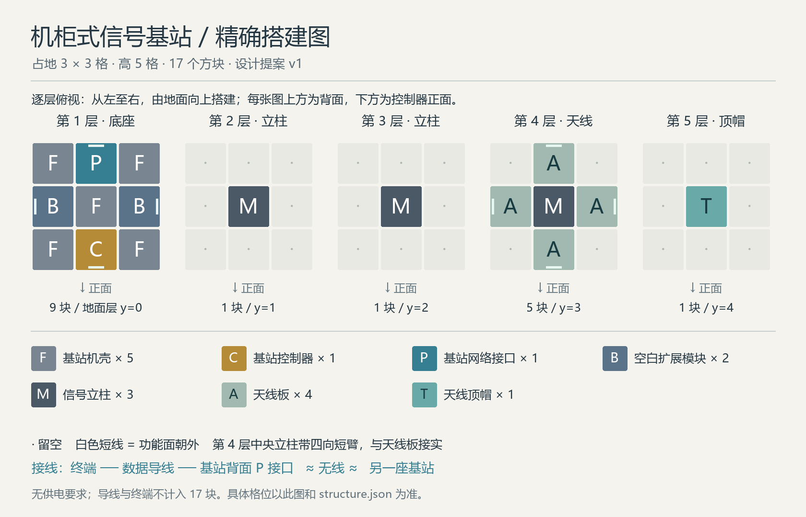

# 机柜式信号基站 · 多方块与贴图提案 01

日期：2026-09-30。本文保留最初的设计记录。

后续实现：七种基站部件、实际模型、成型检测与检查界面已加入当前开发版；
后续 2026-10-01 已加入共用数据导线及本地终端接入，见 [数据导线说明](../data-cable-usage.md)；无线传输尚未实现。
下文“尚未实现”等描述记录的是设计阶段状态，
当前行为及搭建方法以 [基站使用说明](../base-station-usage.md) 为准。

本稿建议基础基站采用 **3 × 3 格占地、5 格高、17 个方块**。下方是一层机柜底座，
上方为细立柱、四向板式天线和顶帽。灰色机壳、浅色金属框、琥珀色文件夹标识延续现有 NAS 外观。
尺寸、部件划分与材料数量是本稿建议，尚非用户确认的最终规格。

用户已经确认的方向：终端用导线连接本地基站，基站之间无线收发；先做基础功能，
以后通过更多或不同的功能方块升级跨维度、连接数量、吞吐量；整个系统不要求供电、不消耗能量。
相关背景见 [物流规划](../logistics-plan.md) 与 [生产程序设计](../production-program-plan.md)。

## 整体外观



已知图示问题：整体概念图的底座分格有误，中央立柱与格位的对应也不够准确。
实际底座必须是完整的 **3 × 3 九个方块**，立柱放在中央机壳的正上方，不能放在方块接缝上。
此图保留作为外观参考，不能直接照其接缝搭建。

概念图用于确定轮廓和材质。图中的透视尺寸线、支架细节及引线位置不是工程尺寸；
具体格位与数量以以下搭建图和 [结构坐标清单](base-station-v1/structure.json) 为准。
像素纹理以独立贴图初稿为准，不从概念图截图裁切。

## 结构和搭建顺序



所有俯视图上方是背面，下方是控制器正面。地面层为 y=0；在坐标清单中，
x 向右、y 向上、z 向背面，控制器在 `(1,0,0)`，朝北。整座结构可随控制器水平旋转。

| 标记 | 部件 | 数量 | 位置与用途 |
| --- | --- | ---: | --- |
| F | 基站机壳 | 5 | 底座四角和中心，组成外壳并承托立柱 |
| C | 基站控制器 | 1 | 底座正面中央，设置站名、查看成型和接入状态 |
| P | 基站网络接口 | 1 | 底座背面中央，连接本模组的数据导线 |
| B | 空白扩展模块 | 2 | 底座左右两侧中央，功能面朝外，预留以后替换 |
| M | 信号立柱 | 3 | y=1、2、3 的中心位置；最上段带四向短臂 |
| A | 天线板 | 4 | y=3 中心立柱的四个水平邻格，接臂向内、板面向外 |
| T | 天线顶帽 | 1 | y=4 中心，收束塔顶轮廓 |
| | **合计** | **17** | 不含地基、导线、终端与 NAS |

搭建时先铺九格底座，正面放控制器、背面放网络接口、左右放空白模块；
中心向上放三段立柱，在第三段周围接四片天线，最后加顶帽。
图中空白位置留空，细立柱和天线虽然没有填满整格，仍分别占用独立的方块位置。
无需额外的专用地基；露天摆放便于辨认，本稿不把露天或天空可见度作为联网条件。

七种外观部件不等于必须制作七套独立配方。实现时可评估让顶帽复用立柱的变体，
但成型判定仍需要明确的顶端部件；本稿暂时单独列出，避免搭建含义不清。

## 部件尺寸与建模边界

使用 Minecraft 的 16 个模型单位 = 1 格。下表是建模建议，全部几何限制在各自方块内。

| 部件 | 建模建议 |
| --- | --- |
| 底座各块 | 标准 16 × 16 × 16 壳体；边框、螺钉、屏幕、把手阴影先通过贴图表现 |
| 普通立柱 | 6 × 6 截面的通高柱芯；上下连接圈最大 8 × 8，避免整格粗柱 |
| 天线层立柱 | 同一种立柱的四向支架状态；短臂截面 2 × 2，从柱芯延伸至四个水平边界 |
| 天线板 | 正面宽 10、高 14、厚 2；用 2 × 2 短臂从内侧边界接到板背 |
| 顶帽 | 下方 8 × 8、4 单位高的连接座，上方 3 × 3、12 单位高的短杆，总高 16 |
| 接线口 | 背面的小型凹槽，开口建议 4 × 4；导线截面建议 2 × 2，接至接口面，不额外生成长管头 |

以朝北的天线板为例：板体从 `[3,1,4]` 到 `[13,15,6]`，连接臂从
`[7,7,6]` 到 `[9,9,16]`；其他朝向水平旋转。中心立柱同高度的短臂伸至边界，
使两格之间连续接合。不能仅给外侧天线加臂，否则中央细柱与边界之间会留下空隙。

针对之前出现的贴图闪烁，本稿采用以下建模约束：

- 文件夹、指示灯和装饰线直接绘入表面贴图，不再用共面浮动贴片覆盖。
- 一个可见表面只保留一层；支架、连接圈、柱芯按不重叠的实体段建模，裁掉内部接触面。
- 若实现真正凹槽，先挖开外表面再画内壁，不在完整面前后叠一张相同尺寸的面。
- 保留明确的立柱、天线实际轮廓与选择框，便于玩家放置、拆卸。

这些约束用于后续落地；当前未生成正式模型，不能据此宣称已经通过游戏内防闪烁测试。

### 成型前后的外观建议

本稿建议每个部件使用自己的方块模型：放下立柱就显示细立柱，放下天线板就显示薄板和安装臂。
一个方块位置内可以由多个小长方体组成外形，不要求填满 16 × 16 × 16 的整格空间。
现有 NAS 已使用这类长方体组合模型；天线板、连接圈和支架也可沿用同样的资源方式。

结构校验成功后，控制器启用联网功能并显示有效结构状态；具备接入条件时才显示在线。
连接臂按相邻部件和方向选择对应模型状态，拆除后及时更新。
这套建议不要求把 17 个部件隐藏，再由控制器渲染一整座高精度塔。
逐块保留模型更容易让选中、碰撞、拆除和缺件提示对应玩家实际放置的部件。

目标是保留概念图的轮廓、面板层次和像素材质。图中的柔和阴影与材质高光是概念渲染效果，
不能承诺无光影模组的游戏画面与效果图逐像素一致。是否需要额外细节，应以实际模型预览判断。
这段是实现路线建议，尚未制作模型或通过游戏内验证。

## 贴图初稿


已提供 **12 张 32 × 32 不透明 PNG**，包含机壳侧面和顶面、四种控制器状态、网络接口、
空白模块、立柱侧面、天线正背面和顶帽。原图位于 [textures 目录](base-station-v1/textures/)，
具体文件和面分配见 [贴图说明](base-station-v1/texture-notes.md)。

- 主体沿用冷灰机壳和浅灰边框，不采用大面积高亮或发光核心。
- 控制器用文件夹与网络节点图标表达“存储网络”，不增加电池或能量槽。
- 天线用浅色面板与纵向刻线，便于远处辨认。
- 控制器状态建议：灰色离线、绿色在线、青色传输中、红色结构或连接错误。
  颜色同时配合控制器界面中的文字原因，不只靠灯色告知故障。
- 当前 PNG 无透明面、无发光层。指示灯先随贴图状态切换；是否加入动画以后再定。

这是可以继续制作模型的像素素材初稿。立柱、天线的窄面还需在实际模型上完成 UV 裁切和映射，
再检查近景、远景、各朝向与不同光照下的表现。

## 接入与升级位置

基础连接关系：

```text
终端 A ─ 数据导线 ─ 基站 A  ≈ 无线链路 ≈  基站 B ─ 数据导线 ─ 终端 B
```

右键控制器建议查看结构缺件、站名、网络状态和本地终端列表。文件浏览、选择收件目录和发起发送仍在终端进行。
背面的 **基站网络接口** 连接本模组导线，与已有的“文件夹物流接口”分工不同；
它不因联网就向第三方管道开放库存。两地生产控制网络也不因基站互联而合并。

两个 B 位首版安装空白模块，没有加成，也不要求插入升级件才能工作。
以后可替换为跨维度、连接或吞吐功能模块；数量更多的扩展机架再单独设计，
因此这两个位置不是整个系统永久的升级上限，也不承诺基础底座能同时装齐三类升级。
功能模块应同时用图标和结构差异区分，不能只变颜色。

本稿建议基础版先做同维度收发，不主动加载区块。结构缺失、导线断开或必要设备未加载时，
拒绝新的发送并保留源端物品；已经执行中的传输需要另外设计一致性与恢复机制。
距离规则、连接数定义、速率、配方及权限仍待后续确定，本稿不为其设定数值。

## 文件和校验

- [整体概念图](base-station-v1/concept.png)：内置 image_gen 生成，未使用 CLI；
  [完整生成提示](base-station-v1/image-prompt.txt) 已保存。
- [逐层结构图](base-station-v1/structure.png) 与 [坐标清单](base-station-v1/structure.json)：
  由 [结构脚本](base-station-v1/generate-structure.py) 生成，检查了 17 个格位无重复以及每种部件数量。
- [贴图联系表](base-station-v1/texture-sheet.png)、12 张原始贴图与清单：
  沿用项目原生像素资产方式，由 [贴图脚本](base-station-v1/generate-textures.mjs) 确定性生成；
  检查了全部原图为 32 × 32、每个像素完全不透明。

从仓库根目录重新生成精确图和贴图：

```powershell
python docs/concepts/base-station-v1/generate-structure.py
node docs/concepts/base-station-v1/generate-textures.mjs
```

结构图脚本需要 Pillow；Windows 默认使用微软雅黑，其他环境可用 `STATION_FONT` 指定中文字体。
本轮只产出设计文档和素材，没有改动现有游戏贴图、注册新方块或修改网络逻辑。
