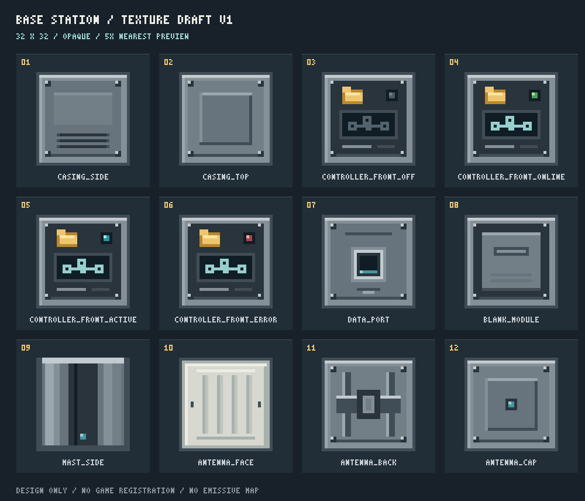

# 基站贴图初稿 v1

这些是可复用的原生像素资产草稿，尚未注册为游戏方块，也未写入正式资源目录。整体效果以主设计稿为准，贴图文件为精确的 **32 × 32 RGBA PNG**；所有像素均不透明，未制作发光贴图。



联系表按原始贴图 **5 倍最近邻**显示，编号与以下表格对应。

| 编号 | 文件 | 面与用途 |
| --- | --- | --- |
| 01 | `casing_side.png` | 通用机壳侧面：灰色箱体、四角固定件、下部散热槽 |
| 02 | `casing_top.png` | 机壳顶面与通用底面：凹入方形检修板 |
| 03 | `controller_front_off.png` | 控制器正面，离线灰色状态灯 |
| 04 | `controller_front_online.png` | 控制器正面，在线绿色状态灯 |
| 05 | `controller_front_active.png` | 控制器正面，传输中青色状态灯 |
| 06 | `controller_front_error.png` | 控制器正面，异常红色状态灯 |
| 07 | `data_port.png` | 背面接线口：单个紧凑方形插口，以青色细节表达数据连接 |
| 08 | `blank_module.png` | 空白扩展模块外侧：无功能图标的可拆盖板与横向把手 |
| 09 | `mast_side.png` | 细立柱侧面：深灰中心槽、浅灰纵向加强筋 |
| 10 | `antenna_face.png` | 天线板朝外的象牙浅灰表面，细长刻线，无整面发光 |
| 11 | `antenna_back.png` | 天线板朝内表面，灰色安装背板；窄侧面可取边缘区域 UV |
| 12 | `antenna_cap.png` | 顶帽上表面：灰色封盖、中心小青色标记 |

控制器上的琥珀色文件夹沿用现有存储设备的视觉符号，屏幕只显示网络节点图案。灰、绿、青、红是拟议状态色；当前素材不代表这些状态逻辑已经实现。细立柱和顶帽上的青色像素是普通颜色，不能用其亮暗判断网络是否可用。

不包含电池、闪电、能量条或供电端口。空白扩展模块没有已安装升级的指示灯；未来扩展模块需要独立设计面板与图标。

## 模型与 UV 建议

- 底座机壳、控制器、接线口、空白扩展模块复用 `casing_side` 和 `casing_top`；只替换对应朝外的一面。
- 立柱与天线板采用较窄的实体模型时，按物理尺寸裁切 UV，避免把整幅 32 × 32 图强行压成一条而使像素密度失衡。各面最终裁切范围应随确定的模型尺寸校准。
- 状态灯和面板细节都直接画在同一张正面贴图上，不新增与机壳共面的悬浮贴片，避免重现硬盘和接口的闪烁问题。
- 天线板的外侧与内侧分别使用 `antenna_face`、`antenna_back`；可见窄侧面复用金属色区域。方块间接触面在最终模型里应隐藏或剔除。
- 材质使用正常光照、最近邻取样与无透明渲染；无需透明层，也无需叠加发光层。

## 重新生成

在仓库根目录运行：

```powershell
node docs/concepts/base-station-v1/generate-textures.mjs
```

脚本只写入本设计目录的 `textures/`、`texture-sheet.png` 与 `texture-manifest.json`，不会修改正式游戏资源。无第三方依赖。生成后会重新读取 PNG，校验所有贴图均为 32 × 32，并检查每个像素的 alpha 都为 255。
