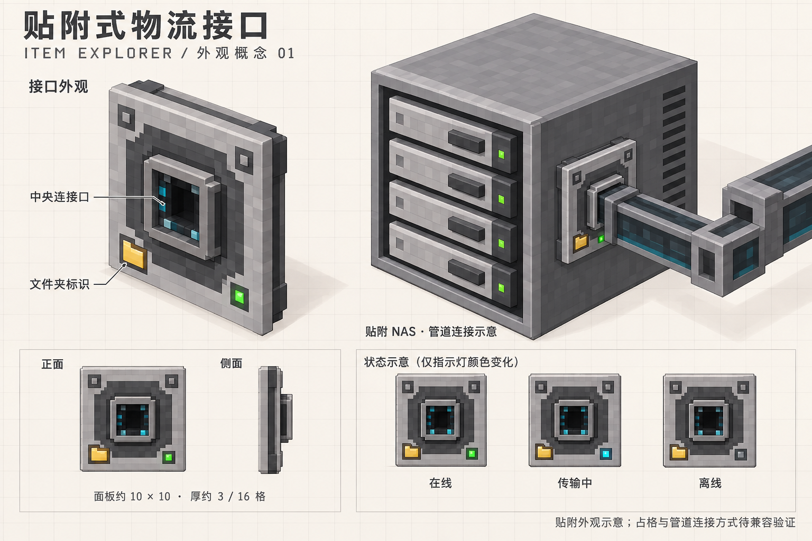

# 贴附式物流接口 · 外观概念 01

日期：2026-09-29。状态：外观讨论稿，尚未实现或定稿。

后续实现说明：此图保留最初的 10 × 10 方案。根据游戏内反馈，当前模型已缩为 6 × 6、面板厚 1/16 格、含插口凸出 2/16 格；连接段仅在外侧邻接设备时显示。实际规格见 [使用说明](../logistics-usage.md)。



## 设计意图

- 延续 NAS 的灰色机壳、浅灰金属边框与深色凹槽。
- 小型贴附面板，名义面板尺寸约 10 × 10 模型单位、厚约 3/16 格；连接口凸起另计，最终以实际模型为准。
- 中央为对外管道连接口，下方保留文件夹标识和状态灯，右键面板进入配置。
- 图中提出绿色在线、青色传输、灰色离线的状态表现；错误状态及输入/输出模式提示待定。
- NAS 和管道均为概念示意，图中的管道不是某个第三方模组的精确模型。
- 支持不同面的贴附朝向是设计建议；可附着设备范围、占格规则及实际连接几何仍需验证。

贴附外观不自动意味着与第三方管道共享同一方块位置。AE2 的同格连接由其部件机制支持；
通用 Forge 物品接口本身不提供跨模组同格放置。需要分别确定普通方块方案与专用部件兼容方案，
并验证管道连接时的位置、间隙和操作区域。首版可优先识别 NAS / 存储终端，普通宿主的用途尚未决定。

参考：[AE2 1.20.1 Cable Subparts](https://guide.appliedenergistics.org/1.20.1/ae2-mechanics/cable-subparts)、[Forge Capabilities](https://docs.minecraftforge.net/en/1.20.1/datastorage/capabilities/)。

## 生成记录

使用内置 image_gen 工具生成，非 CLI；不含实际游戏模型或兼容性实现。
以下为完整生成提示，画面细节以实际输出为准。

```text
Use case: stylized-concept.
Create ONE beautiful landscape concept design sheet for a Minecraft Forge mod named Item Explorer. This is an original proposed surface-mounted external item logistics interface, NOT a screenshot of an implemented feature. Chinese-speaking audience. Render high-resolution clean isometric voxel game asset concept art with crisp pixelated textures and axis-aligned cuboid geometry, buildable as a Minecraft block model, not a photorealistic gadget. Background warm off-white with subtle very pale grid, generous whitespace and neat graphite typography.
Design language matches the project's existing NAS: medium gray concrete casing, light gray metal trim, black recessed cavities, iron tray faces, tiny green and cyan lights. NAS is a single Minecraft cube with exactly FOUR horizontal front drive trays, small handles, four tiny separate status lights, slotted side ventilation. No tall cabinet.
NEW INTERFACE: A compact SQUARE surface-mount plate, roughly 10 x 10 Minecraft model units on a 16 x 16 host face, about 3 units thick before any connector extension. Light gray squared stepped frame, dark graphite inset, FOUR tiny square corner fasteners, CENTRAL recessed square dark item-transfer socket with a metal lip, one SMALL amber pixel folder emblem at lower-left, one tiny green status LED at lower-right. No display screen, no antenna, no wireless symbols, no giant cube casing. Restrained cyan accent inside socket. Same exact design in every view. This is the gateway for EXTERNAL pipes, while wireless functionality belongs to terminals elsewhere.
Composition: understated header top-left, exact title "贴附式物流接口", subtitle "ITEM EXPLORER / 外观概念 01". Three clear visual areas:
Left upper 45%: large detailed standalone isometric view of the thin plate, rotated so front, top thickness and side thickness are all visible, label "接口外观". Show small neat two leader callouts "中央连接口" and "文件夹标识". The visible folder emblem is small enough to leave the central connector free.
Right upper 55%: larger contextual three-quarter view of the single-cube FOUR-BAY NAS, with SAME plate visibly mounted FLUSH onto its side surface. A short square generic item pipe fits directly into the plate's central connector, extending sideways out into free space with one right-angle turn. Make the geometry intersection and physical contact completely clear. Label "贴附 NAS · 管道连接示意". Pipe appearance gray frame, dark transparent core with subtle cyan edge, generic not claimed as an exact Mekanism asset. Leave visible room for the plate's folder emblem and status LED next to pipe.
Bottom left: two small orthographic views of the identical plate front and edge/profile, labels "正面" and "侧面"; small caption "面板约 10 × 10 · 厚约 3 / 16 格". Proportions must look like a thin plate.
Bottom right: three small identical front plate state views with only light color changed and exact labels "在线" green, "传输中" cyan, "离线" unlit gray. These are proposed visual states.
Bottom discreet footer exact text "贴附外观示意；占格与管道连接方式待兼容验证".
Avoid: glossy realism, curves, rounded corners, complex sci-fi machinery, clouds, antennae, floating pipe gaps, multiple inconsistent versions, AE2 logos, extra text, watermark, many duplicated panels. The final sheet should feel like a polished Minecraft mod art direction proposal, with the new plate as the main focus and a convincing slim surface-mount silhouette.
```
