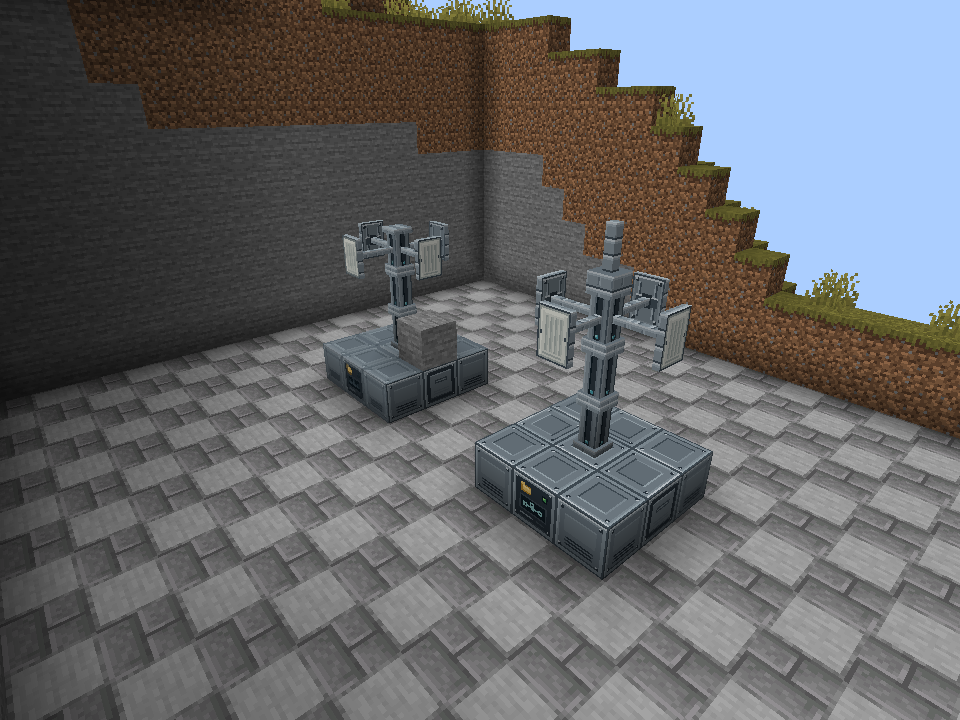
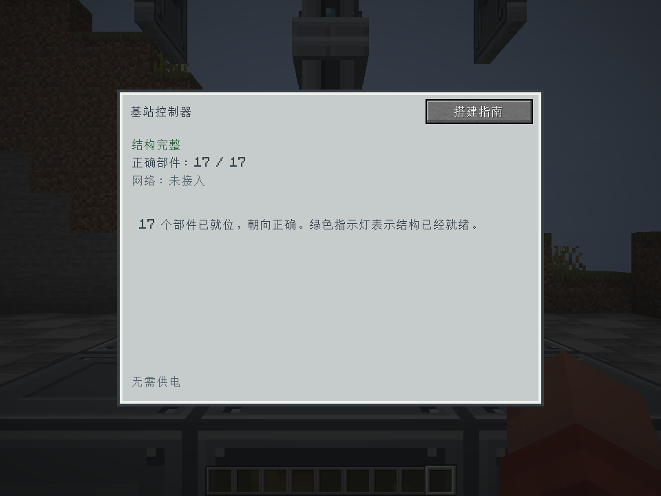
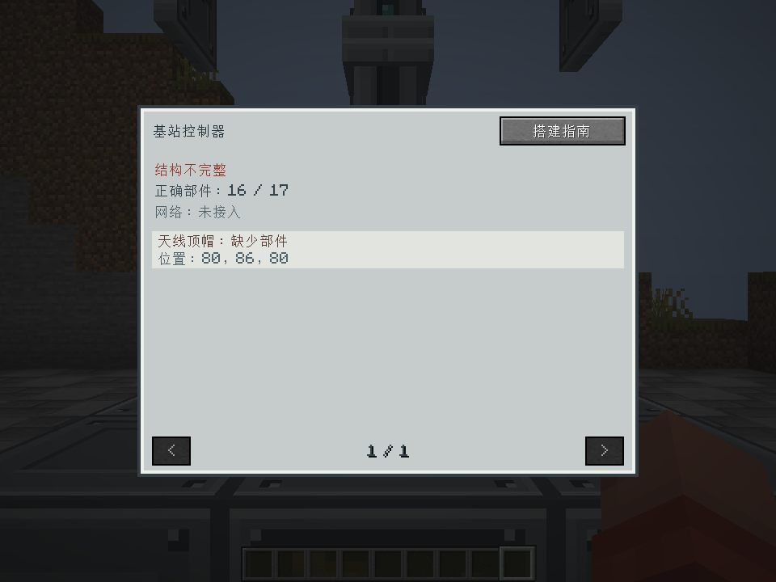
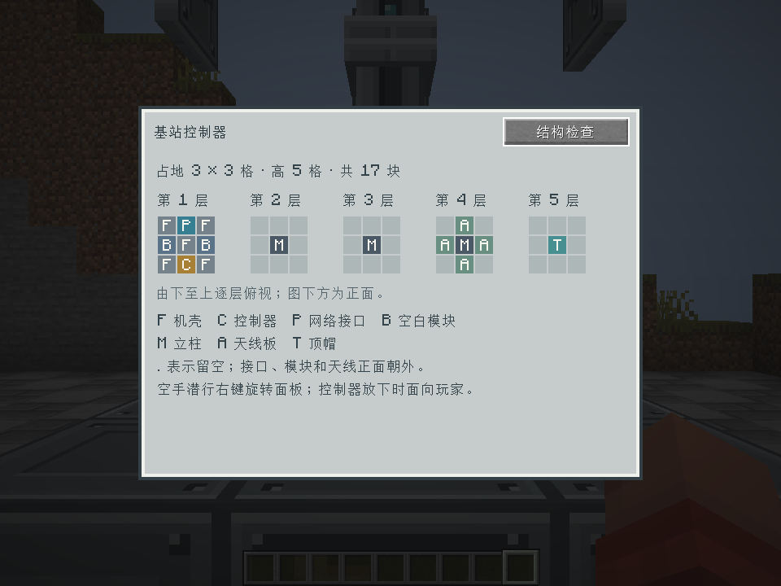
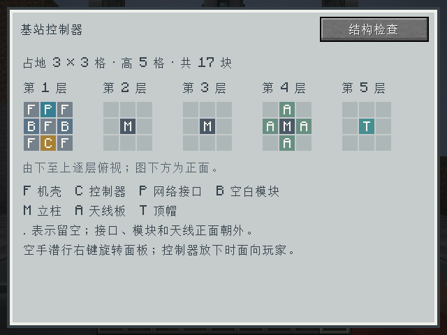

# 基站基础结构验收 · 2026-09-30

环境：Minecraft 1.20.1、Forge 47.4.23、JDK 17，中文客户端，原版渲染。
范围：七种部件、真实方块模型、17 块结构检测、控制器检查窗口及搭建指南。
本轮没有实现导线接入、远程收发、升级模块或能量系统。

## 结果

- `build runGameTestServer` 成功，**85 项必需测试全部通过**，其中新增 8 项基站测试。
- `node scripts/check-base-station-models.mjs` 通过：18 个方块/物品模型、44 种方块状态、
  16 张不透明贴图、7 套配方/掉落/解锁，以及四向连接几何。
  单个组合模型中没有越界实体、实体穿插或共面重叠；模型与纹理引用完整。
- 真实客户端探针成功：44 种方块状态与 7 种物品模型均正常烘焙，所有面引用有效贴图。
- 保持窗口打开，拆掉顶帽后数据从 17/17 更新至 16/17，正确显示顶帽缺失和世界坐标。
- 通过真实界面按钮打开搭建指南；在 960×720 与 640×480 窗口下均完成渲染检查。
- 发布 JAR 包含全部基站资源与双语文本，不包含 GameTest 或客户端探针代码。

## 实机截图

以下五张均来自真实 Minecraft 客户端；不是概念图或离线渲染。



前方为完整基站；后方为缺顶帽的对照结构，旁边的石头用于查看邻接面显示。









另保留 [正式 JSON 模型的离线预览](model-preview.png)，它直接读取模型和贴图，但不是游戏截图。

## 覆盖与边界

新增服务端测试独立搭建完整结构，不调用结构验证器的格位生成函数构造测试答案。
覆盖四个水平朝向、17 个必需格位逐一拆装、错误朝向、错误方块、连接臂变化、
碰撞与选择框、邻面剔除、七种部件掉落，以及重载时重新判断旧成型标记。

未加载边界使用真实验证逻辑和注入的区块可用性函数，断言不可用位置不会被读取；
没有把它称为真实区块卸载或跨维度物流测试。重载测试针对方块实体重建，不等于完整服务器重启验收。

客户端探针仅修改 `work/base-station-client/saves/Base Station Probe` 这个隔离副本，
修改前校验存档真实路径。初次整塔截图的相机落在清理范围外，被地形遮挡；
已调整至场景内部，增加相机不在实体方块内的检查，并重新通过验收。
本目录保留的是调整后通过检查的截图及 [客户端报告](report.txt)。

## 复现

```powershell
node scripts/check-base-station-models.mjs
powershell -NoProfile -ExecutionPolicy Bypass -File .\dev.ps1 build runGameTestServer --console=plain
powershell -NoProfile -ExecutionPolicy Bypass -File .\dev.ps1 runClient --init-script scripts/base-station-client-test.init.gradle --console=plain
```

最后一条要求事先准备隔离测试世界与中文设置，详见 [基站使用说明](../../../base-station-usage.md)。
客户端验收仅修改探针摄像机后重跑，正式代码和资源未改变，因此没有重复运行已通过的服务端测试。

本轮生成包：`build/libs/itemexplorer-1.20.1-0.4.0-dev.jar`。

SHA-256：`63e8f4579cb3c72a82c4297ab35121c440cd643ec46ca453b8753c159e35aa71`。
