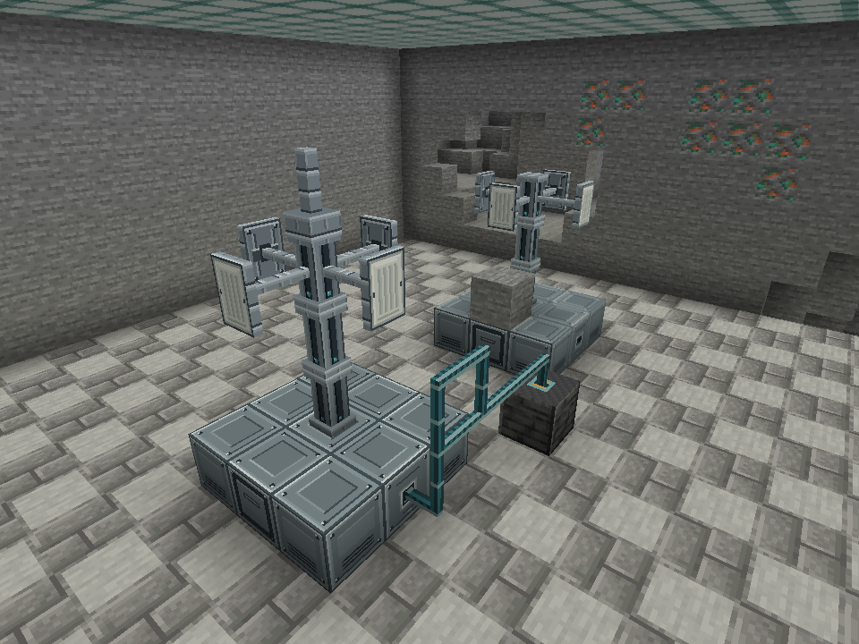
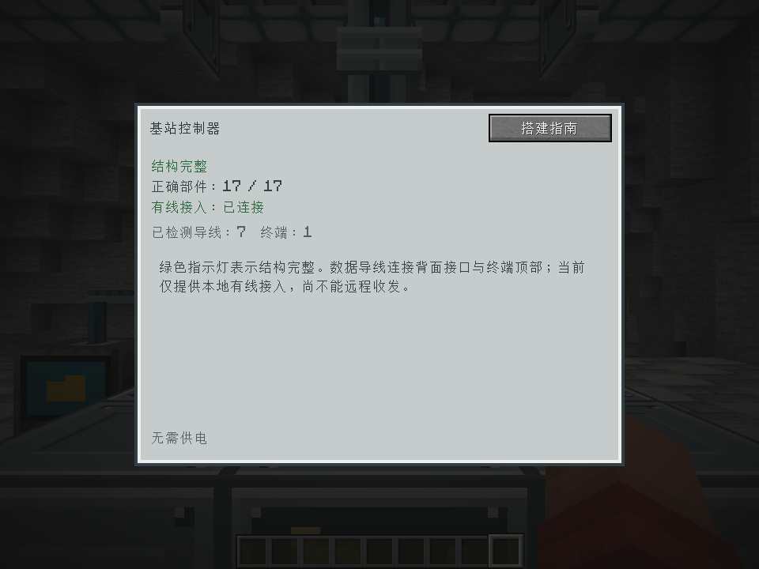
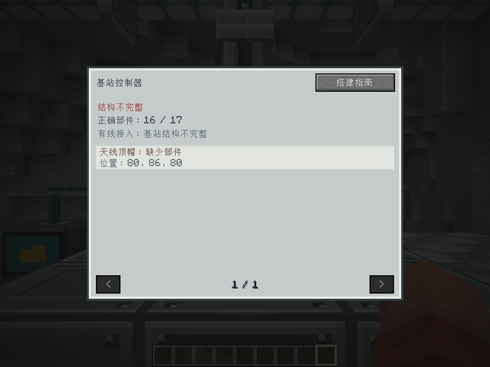
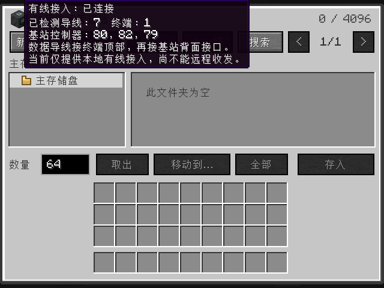
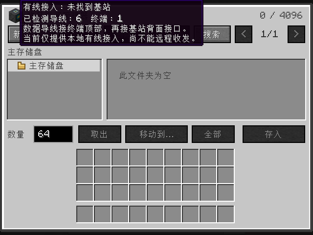

# 数据导线与基站本地接入验收 · 2026-10-01

这是首轮实现的历史记录。随后已扩展为终端/NAS 六面接线与多 NAS 访问，见 [后续验收](../wired-nas/README.md)。

环境：Minecraft 1.20.1、Forge 47.4.23、Eclipse Temurin JDK 17.0.2，中文客户端。
本轮实现共用数据导线、终端顶部接线、基站接口接线、连通检查和菜单状态同步。
机器接口、生产程序和站间无线收发不在本轮实现范围。

## 结果

- `build runGameTestServer` 成功，**97 项必需测试通过**，其中 12 项为新增导线测试。
  [运行摘要](gametest-summary.txt)保留最后一次完整测试的结果。
- 新增测试覆盖：四向基站接入，六向导线及实际放置上下文，指定接线面，分叉和环路去重，
  断线拆塔与修复，多基站接口冲突，未加载位置禁止读取，256 段上限，未来设备端点注入，
  打开菜单后的状态刷新及库存/会话不受影响，大坐标经过原版 short 数据槽的同步。
- `check-data-cable-assets.mjs` 通过：64 种连接组合、贴图引用、配方、掉落、解锁与双语状态文本。
  原有 `check-base-station-models.mjs` 也通过。
- 真实客户端探针通过：112 种方块状态及 9 种物品模型正常烘焙，所有面均引用真实贴图。
  基站界面显示 7 段导线和 1 台终端，拆顶帽后实时显示结构失效；终端收到正确控制器坐标，
  断线后显示未找到基站，接回后自动恢复。详情见 [客户端报告](report.txt)。
- 客户端验证 960×720 与 640×480 窗口；终端状态悬停提示在最小窗口完整可读。
- 发布 JAR 包含导线代码与资源，不包含 GameTest 或客户端探针代码。

未加载测试注入可用性函数，不宣称完成真实区块卸载验收；未来设备测试注入接线面实现，
不表示机器已经适配。没有开展远程传输、完整服务端重启或真实双客户端联机验收。

## 实机截图

以下均由实际 Minecraft 客户端渲染。隔离场景采用海晶灯照明与夜视效果以清晰展示连接，
截图没有后期增亮，也不是概念图。前方为完整基站，后方缺顶帽；导线接向独立终端顶部，
中间的环形线路用于展示上下连接、转弯和分叉。











探针只修改 `work/base-station-client/saves/Base Station Probe` 这个隔离副本，并在修改前校验真实路径。
原有 `run/saves` 存档只用于复制。本次为查看背面导线调整了探针相机和场景照明；
正式代码不包含这些测试效果。

## 产物与复现

产物：`build/libs/itemexplorer-1.20.1-0.4.0-dev.jar`。网络协议为 7。

SHA-256：`2370317745f5d59673186aa4860896ae5feb15d539a5d272e0de0a2fb627f3eb`。

```powershell
node scripts/check-data-cable-assets.mjs
node scripts/check-base-station-models.mjs
powershell -NoProfile -ExecutionPolicy Bypass -File .\dev.ps1 build runGameTestServer --console=plain
powershell -NoProfile -ExecutionPolicy Bypass -File .\dev.ps1 runClient --init-script scripts/base-station-client-test.init.gradle --console=plain
```

最后一条需提前准备独立测试世界与中文设置，详见 [基站说明](../../../base-station-usage.md)。
正常游玩使用不带探针的 `runClient`。操作规则见 [数据导线说明](../../../data-cable-usage.md)。
