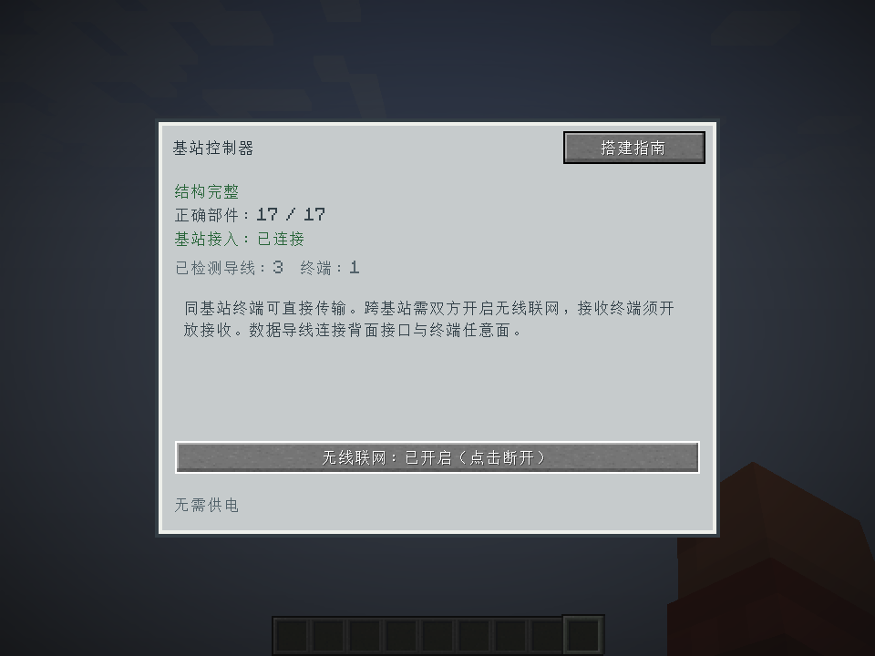
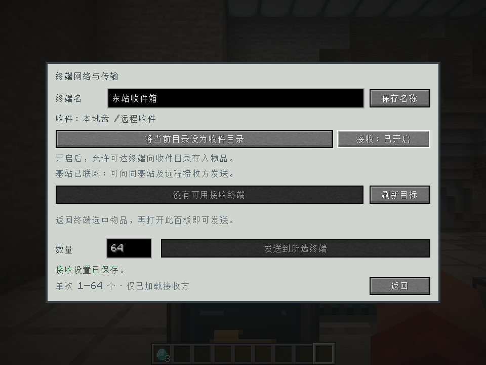
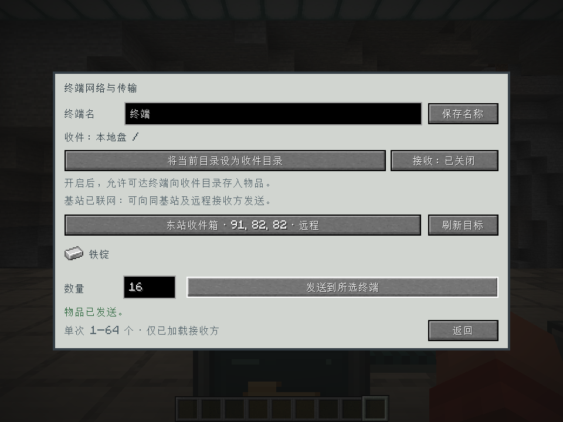
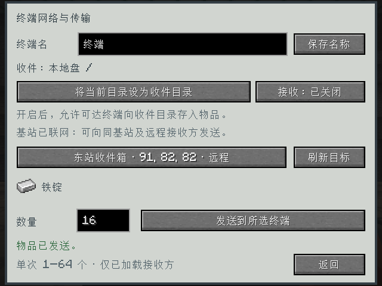
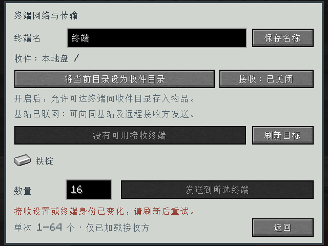

# 终端发送与基站无线网络验收 · 2026-10-01

本轮实现同基站直传，以及双方基站显式加入同维度公共网络后的站间发送。
操作方法与限制见 [终端传输说明](../../../remote-transfer-usage.md)。

## 验证结果

- 构建成功，**187 项 GameTest 全部通过**，包括本轮新增的 27 项；见 [测试摘要](gametest-summary.txt)。
- 8 项库存原子转移测试：数量/NBT 保留、容量与条目上限、保护状态、拒绝不改变版本、
  同盘目录移动、搜索版本语义、双方脏标记观察到完整提交，以及普通保存状态的重新读取。
- 13 项传输服务测试：同站无需无线开关、默认接收关闭、跨站双方开关、断线和拆塔、收件配置变更、
  删除目录、满盘全拒、数量限制、不可堆叠物品、共享 NAS、换盘/换终端、接收配置保存、吞吐额度。
- 6 项协议测试：编解码边界、旧库存版本及重复请求、旧挂载会话/关闭/重开、伪造绑定目录、
  多人配置版本冲突，以及收件盘离线后仍能关闭接收。
- 真实中文客户端经实际按钮和网络消息完成两座基站联网、收件目录绑定与开启、发送 16 个铁锭。
  服务端核对源端 **64 → 48**、目标目录 **0 → 16**，总量 64 不变。
- 目标断网后从列表移除，发送按钮不可用；继续提交原目标身份的旧请求被服务端拒绝，不扣物品。
- 验证 960×720 与 640×480 窗口。切到发送面板、缩放、再返回终端后，菜单会话不变，
  鼠标上的 3 个钻石保留，并能通过真实槽位点击放回背包。
- 中英语言文件均有效且无重复键；发布 JAR 包含传输实现，不含 GameTest 或客户端探针。

客户端具体过程见 [客户端报告](report.txt)。环境：Minecraft 1.20.1、Forge 47.4.23、Temurin JDK 17.0.20.1。
客户端验收使用单个真实客户端与集成服务器；多人协议场景使用服务端 FakePlayer，
没有把这些结果扩大为两台独立客户端、真实网络延迟或强杀崩溃恢复已验证。

**持久化边界仍沿用现有存档：没有跨区块/盘文件的崩溃原子事务。**
普通保存状态重新读取通过不代表进程强杀、断电或保存中断时两端能同步恢复。

## 实机画面











截图来自真实游戏渲染，未做后期编辑。探针只修改严格路径检查通过的隔离副本
`work/remote-transfer-client/saves/Base Station Probe`，验收结束会退出；它不用于普通游玩。

## 产物与复现

产物：`build/libs/itemexplorer-1.20.1-0.4.0-dev.jar`。
网络协议 **12**，客户端和服务端需要使用同一构建。现有库存格式不变，新增接收配置和基站联网开关的 NBT 字段。

SHA-256：`bfb447ece2812f59231b51981355d92039fc66cbaae45cbb7a4b3e2a5eaae4d2`。

```powershell
powershell -NoProfile -ExecutionPolicy Bypass -File .\dev.ps1 build runGameTestServer --console=plain
powershell -NoProfile -ExecutionPolicy Bypass -File .\dev.ps1 runClient --init-script scripts/remote-transfer-client-test.init.gradle --console=plain
```

客户端命令运行前需在上述隔离路径准备测试世界及 `work/remote-transfer-client/options.txt` 的中文设置。
本轮从已有基站验收世界复制独立副本，未覆盖正常游玩存档。
复跑中曾遇到系统提交内存不足；内存恢复后的最终完整命令成功，以上结果取自最终运行。
