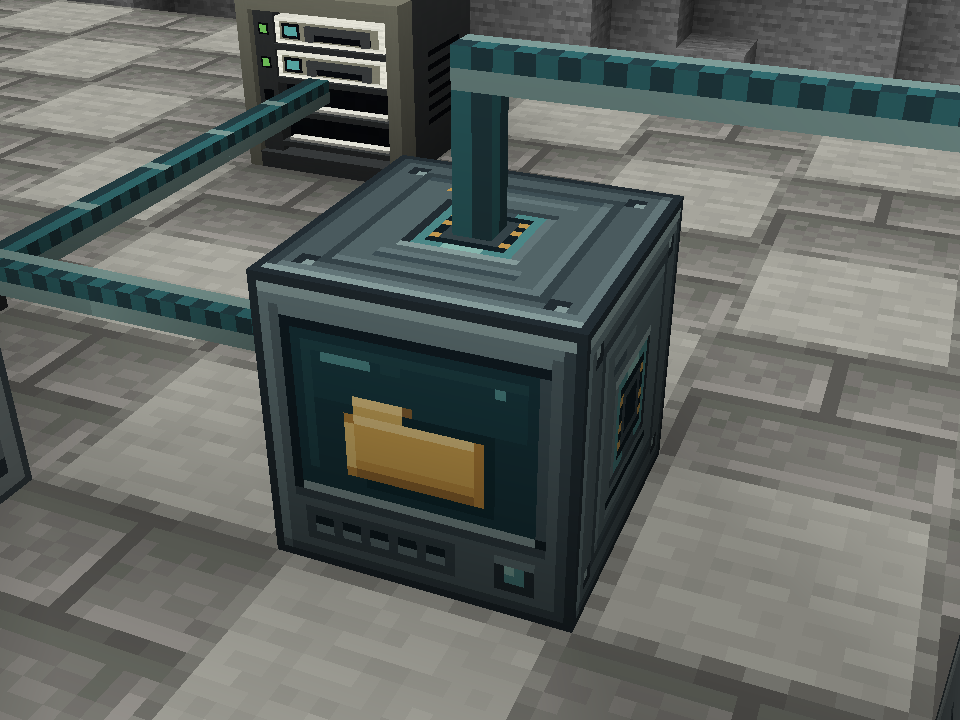
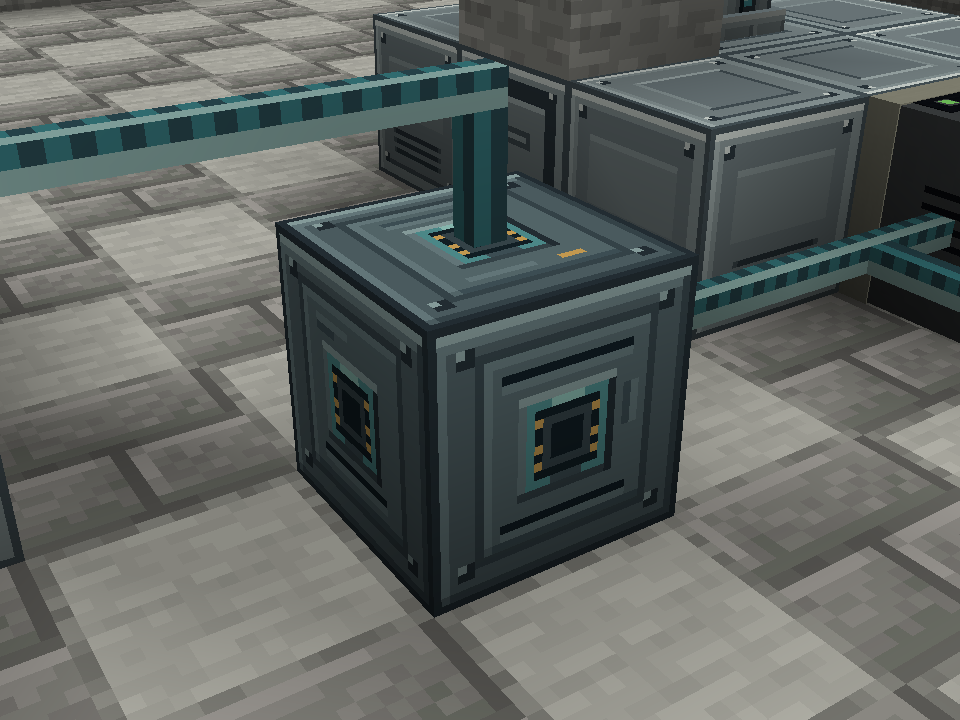
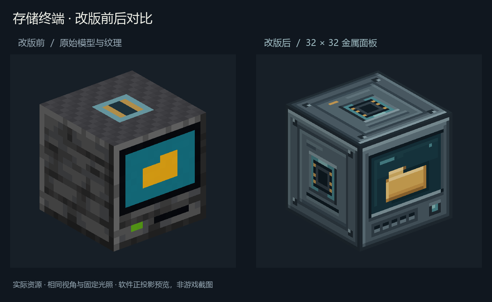

# 存储终端外观更新 · 2026-10-01

终端使用五张独立的 32×32 原生像素贴图：正面、侧面、背面、顶面和底面。
深灰金属机壳、灰蓝边框、暗青屏幕与暖黄色文件夹延续基站的设备风格。
正面通过像素明暗表现屏幕凹陷和文件夹厚度，模型仍是完整立方体。
原来的多层混凝土叠片已合并，所有面的 UV 明确使用 Minecraft 的 0–16 坐标。

侧面、背面、顶面和底面接口均对齐既有导线的面中心落点。
六面接线行为不变，正面保留完整屏幕，正面接线仍会遮挡屏幕中央。
青色按键和屏幕均为静态外观，不表示联网状态，也没有额外发光效果。
新贴图位于独立的 `storage_terminal/` 目录，旧导线生成器不会覆盖它们。

## 验证

- `dev.ps1 build --console=plain` 成功，资源已打入开发 JAR。
- `node scripts/check-data-cable-assets.mjs` 通过，覆盖 64 种导线连接模型。
- 真实 Minecraft 1.20.1 / Forge 47.4.23 客户端探针通过，终端四个朝向和物品模型没有缺失材质。
- 新增正面、背面 960×720 近景截图，等待传送位置、视角和实际渲染帧稳定后捕获。
- 既有两台 NAS、远程取物、断线和恢复验收也通过，见 [客户端报告](report.txt)。
- 截图来自隔离的 `work/base-station-client/saves/Base Station Probe` 存档。







## 修改与重现

颜色与像素布局保存在 `scripts/generate-storage-terminal-assets.mjs`，无需图像服务或外部 Node 包。
软件预览脚本需要 Python、Pillow 和 NumPy；读取当前游戏资源，不重绘贴图。

```powershell
node scripts/generate-storage-terminal-assets.mjs
python scripts/preview-storage-terminal.py
node scripts/check-data-cable-assets.mjs
.\dev.ps1 build --console=plain
.\dev.ps1 --init-script scripts/base-station-client-test.init.gradle runClient --console=plain
```

本次使用 Minecraft 自带的 Microsoft JDK 17.0.15，通过本次进程的
`ITEM_EXPLORER_JAVA_HOME` 指定；未更改系统 Java 配置。
客户端探针只参与显式验收运行，不包含在发布 JAR 中。
