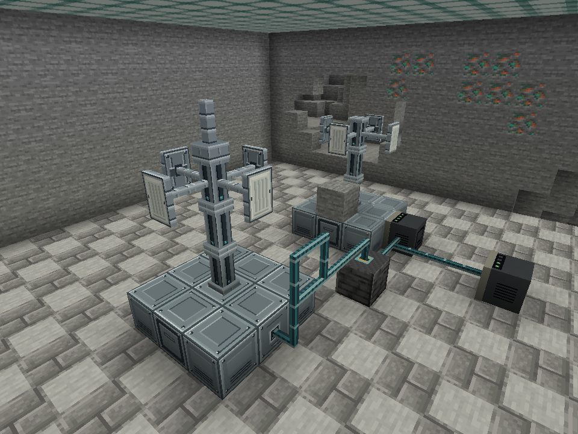
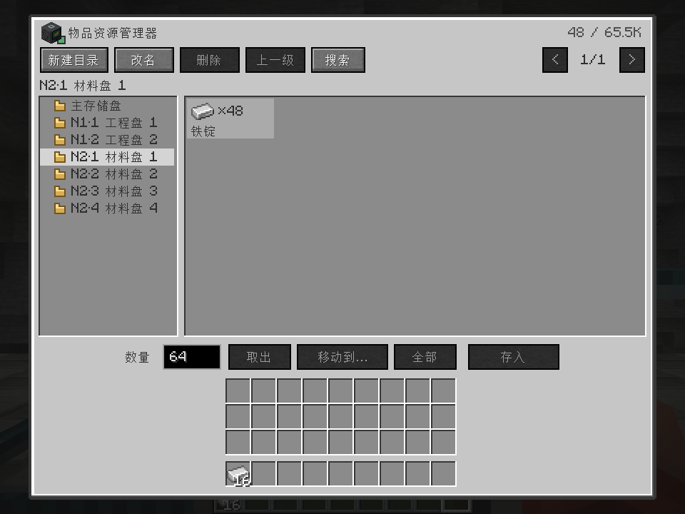
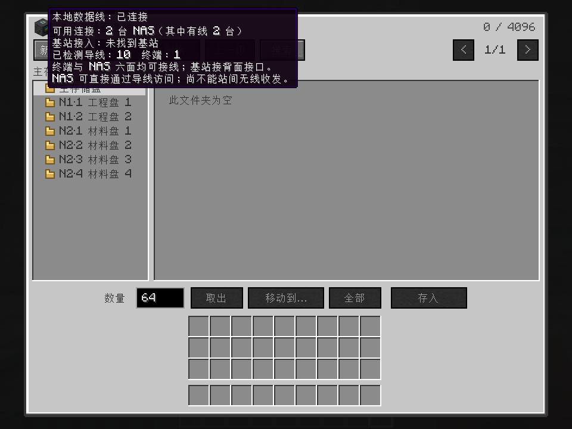
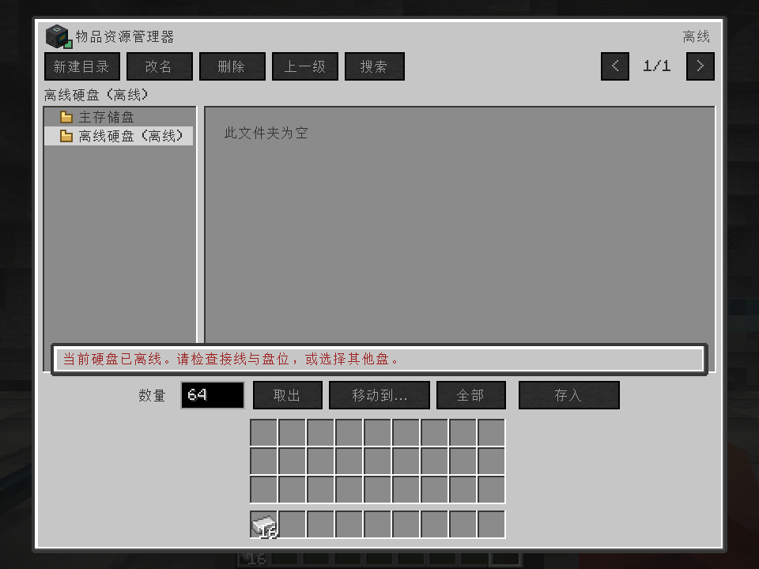
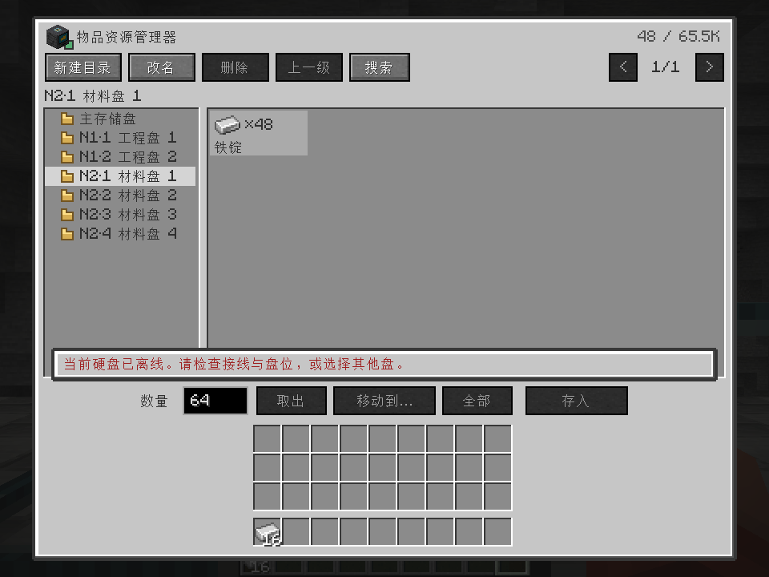
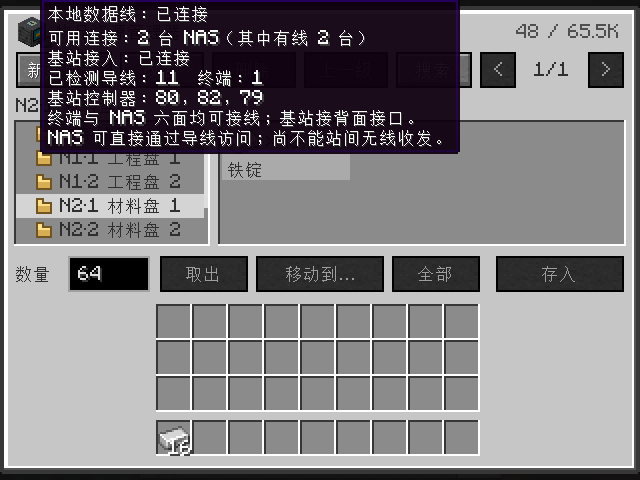

# 六面接线与多 NAS 验收 · 2026-10-01

终端和 NAS 现在支持六面接线。终端列出数据导线可达的所有 NAS 硬盘，无需紧贴或搭建基站，
并保留原有背面贴邻连接。多机箱用编号和盘位区分，悬停可看机箱坐标；实际操作绑定磁盘 ID。

## 验证结果

- 构建成功，**106 项 GameTest 全部通过**，包含新增的 9 项有线 NAS 测试，见 [测试摘要](gametest-summary.txt)。
- 覆盖两台 NAS 的全部 8 个盘位、远端改名/存入/取出、断线后的旧请求、跨机箱搬盘、同坐标换机箱、
  两终端共享库存、贴邻与导线去重、基站冲突不阻断本地 NAS，以及断线搜索失效。
- 六面接线断言通过；导线资源检查覆盖全部 64 种连接形态、贴图、配方、掉落和双语提示。
- 真实中文客户端通过：两台远端 NAS、6 块硬盘全部显示；经实际网络请求取出 16 个铁锭，
  玩家持有 16 个、盘内剩 48 个。断开 NAS 导线后保持原盘选择并显示离线，修复后恢复原盘及数量。
- 单独切断基站线路后，两个 NAS 仍可使用。客户端报告见 [report.txt](report.txt)。
- 960×720 正常窗口及 640×480 最小窗口完成渲染检查。
- 发布包包含有线 NAS 代码与资源，未包含 GameTest 和客户端探针类。

环境为 Minecraft 1.20.1、Forge 47.4.23、Temurin JDK 17.0.2。
多人库存测试使用服务器内的两个测试玩家，尚未进行两个独立客户端联机验证。
未加载区域的底层拓扑测试采用注入函数，尚未进行真实区块卸载验收。

## 实机截图














截图来自真实 Minecraft 渲染，未做后期编辑。探针只修改经真实路径校验的
`work/base-station-client/saves/Base Station Probe` 隔离存档。

## 普通客户端演示存档

项目本机的 `run/saves/Item Explorer - 有线NAS演示` 为上述场景的独立副本，
在正常开发客户端的单人游戏列表显示为 **Item Explorer · 有线 NAS 演示**。
进入位置为 `(83.5, 82, 80.5)`，终端在 `(83, 82, 82)`，两台 NAS 在 `(86, 82, 82)` 和 `(85, 82, 85)`。
材料盘 1 留有 48 个铁锭。这个本地演示存档不提交到 Git；已有其他存档未覆盖。

使用不带探针的 `runClient` 游玩；探针命令会在验收完成后自动退出。

## 构建与复现

产物为 `build/libs/itemexplorer-1.20.1-0.4.0-dev.jar`，网络协议为 **8**，客户端和服务端需使用相同构建。
存档格式未改变。SHA-256：`94bcbd521b21e14a3a035c59ec7e845fade60351f19c7ccf408fbdf012cd1da4`。

```powershell
node scripts/check-data-cable-assets.mjs
powershell -NoProfile -ExecutionPolicy Bypass -File .\dev.ps1 build runGameTestServer --console=plain
powershell -NoProfile -ExecutionPolicy Bypass -File .\dev.ps1 runClient --init-script scripts/base-station-client-test.init.gradle --console=plain
```

客户端命令需提前准备隔离世界与中文设置，见 [基站说明](../../../base-station-usage.md)。
功能规则及上限见 [导线说明](../../../data-cable-usage.md)。
