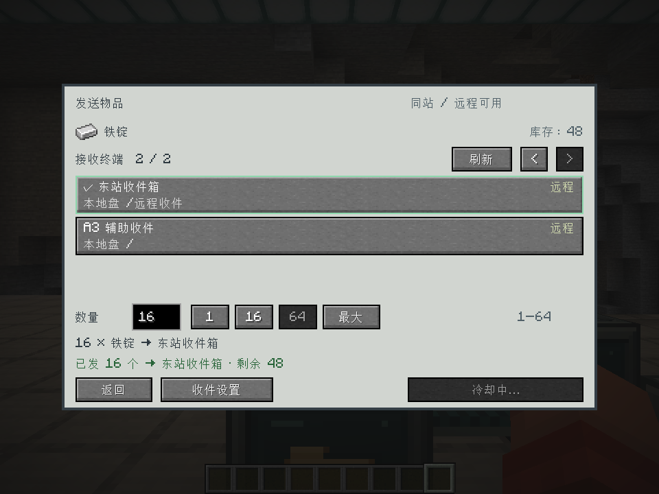
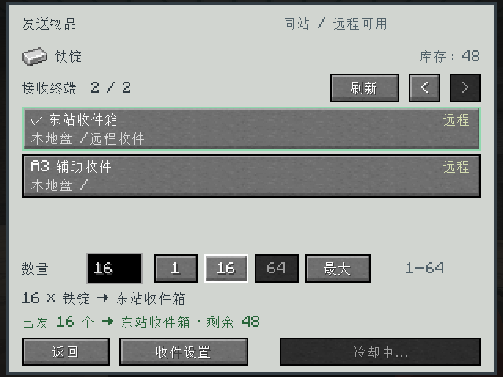
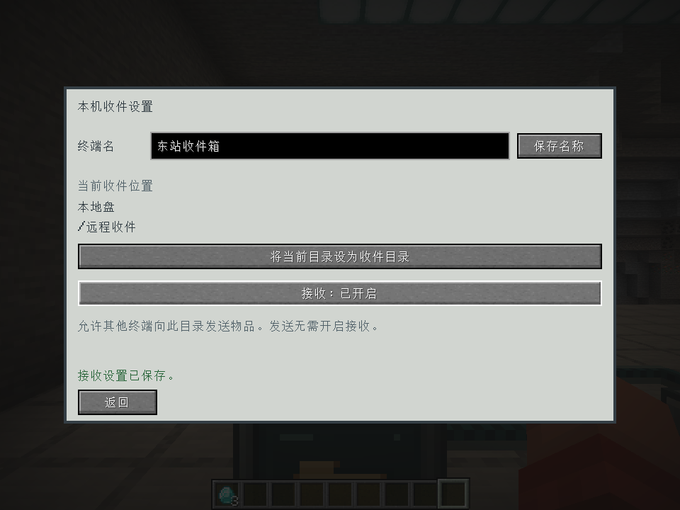
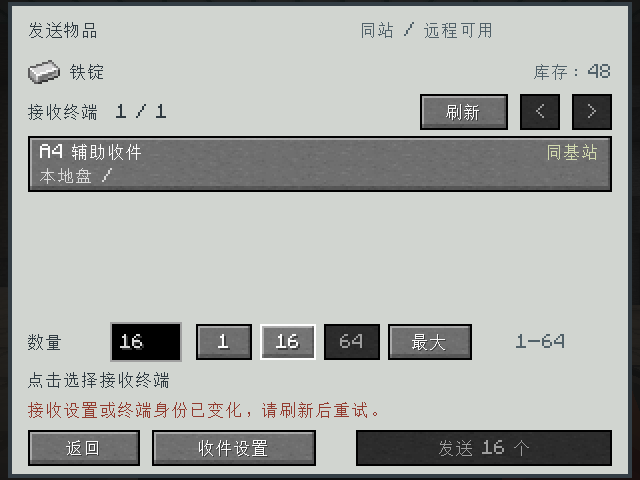

# 紧凑发送界面验收 · 2026-10-03

发送主界面与本机收件设置分开。主界面包含物品和实时库存、每页三个目标、数量快捷按钮、
发送摘要与详细结果。目标列表显示接收盘及目录，沿用终端身份和接收配置版本校验。
操作说明见 [终端传输说明](../../../remote-transfer-usage.md)。

## 验证结果

- 构建成功，**187 项 GameTest 全部通过**，见 [测试摘要](gametest-summary.txt)。
  本轮扩展已有本地和 NAS 接收用例，验证嵌套路径、目录及磁盘改名、配置版本保持、离线盘隐藏，
  不新增自动加载区块，也不修改发送数量、容量和基站冷却规则。
- 真实中文客户端通过实际按钮与网络消息完成命名、绑定收件目录、开启接收和跨站发送。
  服务端确认源端 **64 → 48**、东站收件目录 **0 → 16**，总数保持 64。
- 五个接收终端覆盖目标分页。首次必须明确选择；翻页、进入收件设置、返回和缩放均保持所选身份。
  `1 / 16 / 64 / 最大` 中验证 16 和最大按钮：发送前最大为 64，发送后最大为 48。
- B 站断网后仍保留 A 站的一个本地可用备选。界面清空失效选择并禁发，没有自动改投；
  再提交旧目标身份的请求被服务端拒绝，源端仍为 48。
- 验证 960×720 和 640×480 窗口，GUI 缩放为 2。小窗口所有可见控件在边界内；
  实机截图确认目标、数量、摘要、结果及底部操作没有重叠。
- 切换页面、缩放、返回资源管理器后，菜单会话和鼠标上的 3 个钻石保留；
  返回后仍可通过真实槽位点击放回背包。
- 额外进行了客户端合成快照回归：重放已确认的发送结果，在同一帧连续接收背景库存更新、
  发送成功结果、空消息库存更新。背景更新不会提前解除发送等待，后续空更新不会覆盖详细成功提示。
  该项是客户端结果处理测试，不将其描述为真实网络延迟测试。
- 中英语言文件解析通过、无重复键且键集合一致。发布 JAR 包含发送界面，不包含 GameTest 或客户端探针。

完整客户端过程见 [报告](report.txt)。环境为 Minecraft 1.20.1、Forge 47.4.23、JDK 17。
使用一个真实客户端和集成服务器；多人及请求冲突仍由服务端 GameTest 覆盖。
测试世界严格限定在 `work/remote-transfer-client/saves/Base Station Probe`，不修改普通游玩世界。
原有跨文件保存的持久化边界保持不变。

## 实机画面









以上为真实游戏渲染截图，未做后期编辑。

## 产物与复现

产物：`build/libs/itemexplorer-1.20.1-0.4.0-dev.jar`。
SHA-256：`ca6bbcfc2f822fc6a50d0acecd0c7c33c2df3004095b8557b5d3358ad17243a5`。

网络协议仍为 **12**；本轮只向已有目标快照补充展示字段。客户端和服务端应使用该同一构建。

```powershell
powershell -NoProfile -ExecutionPolicy Bypass -File .\dev.ps1 runGameTestServer --console=plain
powershell -NoProfile -ExecutionPolicy Bypass -File .\dev.ps1 build runClient --init-script scripts/remote-transfer-client-test.init.gradle --console=plain
```

客户端命令需要先准备上述隔离世界副本以及 `work/remote-transfer-client/options.txt` 的中文设置。
客户端验收结束自动退出，最终 `work/remote-transfer-client/result.txt` 应为 `PASS`。
